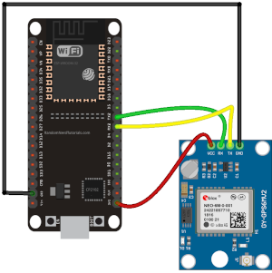
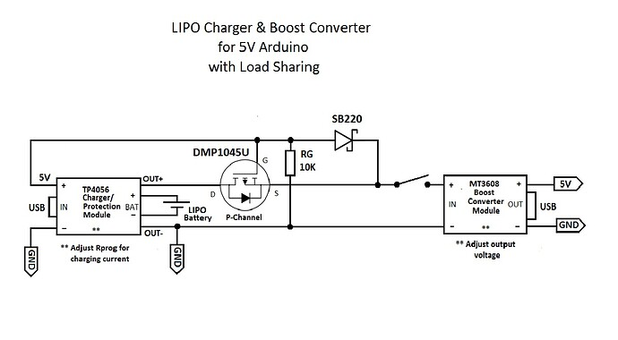
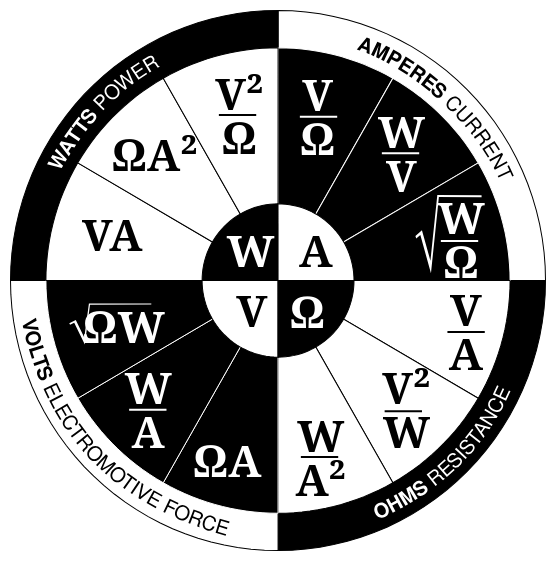

# ESP_32_GPS

Small ESP32 project with a GY-NEO6M GPS, an humidity and temperature Bosch (BME680) sensor, powered by a Li Ion battery , stabilised by a 2A MT3508 buck/boost stabiliser and recharged by a TP4056 recharger via USB-C

BME680 connection

GPS connection

Power stage

Ohm law

